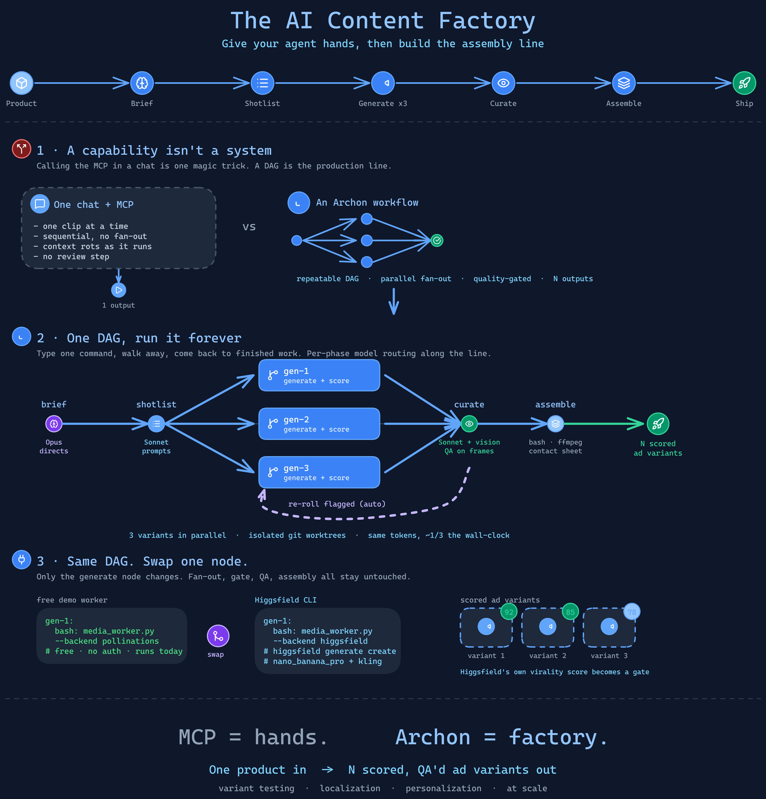

# AI Content Factory

**One product catalog in, a batch of human-approved AI video ads out.** This is what you get when you stop treating an AI coding harness as a "coding" tool and point it at marketing instead: a small, autonomous factory that explores ad concepts for an entire catalog on its own, parks them at a human approval gate, and spends real video money only on the winners you pick.

The engine is [Archon](https://github.com/coleam00/Archon), an open-source AI coding workflow engine. The media worker is the [Higgsfield CLI](https://higgsfield.ai/cli) (swappable). The whole thing runs from the terminal and can sit on a schedule.



---

## The one idea behind the whole system

Your **image** model is cheap and your **video** model is not. On the models used here, a still concept costs about `0.15` credits and animating it to video costs about `7.5` credits: roughly **50x**.

That single price gap dictates the entire shape of the system:

1. **Explore cheap.** Generate and score a couple of ad concepts for *every* product using the cheap image model. Dozens of scored concepts for the price of a coffee.
2. **Approve human.** A person reviews the concepts in a real storefront and approves the ones worth spending on. This is the only step that costs real money, so a human makes it.
3. **Render winners only.** Animate *only* the approved concepts into video. Nothing you did not approve ever costs a video credit.

`Explore cheap -> approve human -> render only winners.` Everything in this repo just runs that one idea safely and at scale.

---

## One approval, two ads

A single approval doesn't just make one video. The render workflow turns each approved concept into **two** finished ads:

1. **Product pan** - the approved still animated into a clean, cinematic push-in/pan (Higgsfield Kling).
2. **UGC talking-head** - a ~10-second spot of a generated person in a kitchen holding the *actual* product and reviewing it in their own generated voice (Higgsfield `gemini_omni`). It's **one continuous take**: a single generation, so there are no seams and no voice/accent changes mid-ad (stitching short clips gave both), and it's checked by a UGC-aware vision rubric (penalizing warping, extra limbs, or any phone/camera UI in frame). The cast is mixed (a per-product gender map, e.g. the grinder and kettle are male reviewers).

Same product, two formats, from one click. Approved products in the storefront's `done` state play **both** ads in their review modal. Sample UGC ads live at `catalog-site/review/{p01,p03,p06,p07,p09,p10}/ugc.mp4` (vision-validated 85-100).

---

## Why a coding harness runs it

The interesting part is what's driving it. Archon is not a marketing product. It is the same kind of agent harness you use to ship software: a plan, a pool of agents, and a loop that runs until the work is done. Here it is pointed at a store instead of a codebase.

- **Worker pool + Ralph loop.** Each worker claims the next unit of work (a product to explore, or an approved concept to render), does it, and loops back for the next, until the queue is empty.
- **Fresh context per item.** Every product is handled in its own clean context, so product #20 is as sharp as product #1. A single chat window rots after a few products; this does not.
- **Atomic claiming.** Work is claimed with a filesystem-atomic `mkdir` lock, so parallel workers never collide. Everything is idempotent: re-running charges nothing for work already done, which is what makes it safe to leave on a schedule.

The takeaway is bigger than ads: these harnesses were built for code, but there is nothing about them that says "code." Marketing is just the example.

---

## The two workflows

| Workflow | Phase | What it does |
|----------|-------|--------------|
| [`content-factory-explore`](.archon/workflows/content-factory-explore.yaml) | Explore (cheap) | A pool of workers drains the catalog. Each claims a product, invents two text-free ad concepts, generates + vision-scores them on the cheap image model, and writes them to the review queue. |
| [`content-factory-render`](.archon/workflows/content-factory-render.yaml) | Render (gated) | A smaller pool animates **only human-approved** concepts into video. Fewer workers, because video is the slow, expensive step. |

The human approval gate lives in between, in a small storefront (`catalog-site/`) where every product shows its scored concepts and you click Approve on the winners.

---

## The media worker is swappable

The Higgsfield CLI is the media worker here because it drives the frontier video/image models (Veo, Kling, Seedance, plus its own Soul) straight from the terminal and is built to be automated. But the DAG does not care what generates the pixels. `.archon/scripts/media_worker.py` is the single swap point (`--backend`), and `animate_concept.py` reads `HF_VIDEO_MODEL`. Point it at whatever generator you like.

---

## Repository layout

```
.archon/
  workflows/
    content-factory-explore.yaml   # phase 1: explore the catalog (cheap)
    content-factory-render.yaml     # phase 2: render approved winners (gated)
  scripts/
    media_worker.py                 # the swappable media worker + image validate/regenerate gate
    score_frame.py                  # vision score for a concept image (Gemini)
    validate_video.py               # vision QA for a rendered video (duration + garble/warp check)
    factory/
      claim.py                      # atomic work queue (mkdir-lock) for the worker pool
      factory_seed.py               # drive EXPLORE over the whole catalog directly
      animate_concept.py            # render ONE approved concept to video + validate + regenerate
      factory_render.py             # drive RENDER over the approved winners
      curate_approvals.py           # pick winners (stand-in for the human approval step)
      merge_queue.py                # stitch per-product results into the storefront queue
      factory_status.py             # read-only status + cost preview (no spend)
catalog-site/                       # the demo storefront (a 20-product "Camber" catalog)
  catalog.json  index.html  review_server.py  stage.py  gen_catalog.py  images/
  review/<pid>/<cid>/{frame.jpg,asset.mp4}   # generated concept stills + rendered videos
  _states/{empty,ready,done}/                # pre-built states for the instant switch
sample-videos/                      # curated example output from a real run
docs/architecture.png
```

---

## Run it

**Prerequisites**
- [Archon](https://github.com/coleam00/Archon) installed and on your PATH.
- The [Higgsfield CLI](https://higgsfield.ai/cli) authenticated: `npm i -g @higgsfield/cli && higgsfield auth login`.
- Python 3.10+ (the scripts use only the standard library plus `uv` for the vision scorer).

**1. Explore the catalog (cheap).** A worker pool generates + scores two concepts per product:
```bash
archon workflow run content-factory-explore --no-worktree "explore the Camber catalog"
```

**2. Approve the winners (human).** Serve the storefront and click Approve on the concepts worth animating:
```bash
cd catalog-site && python review_server.py    # then open http://localhost:8100
```

**3. Render only the winners (gated, expensive).**
```bash
archon workflow run content-factory-render --no-worktree "render the approved concepts"
```

Check status and a cost preview at any time, with no spend:
```bash
python .archon/scripts/factory/factory_status.py
```

Dry-run the render fan-out for free (no credits) with `RENDER_DRY_RUN=1`.

---

## It checks its own work (two validation gates)

The factory doesn't just spray out media and hope. It self-checks at both stages:

- **Image gate (explore):** `media_worker.py` vision-scores every concept image and, if one is weak, off-brand, or has garbled AI text, it **regenerates it** with a cleanup hint and keeps the best. Only clean concepts reach the review board.
- **Video gate (render):** after each render, `validate_video.py` checks the duration and runs a vision QA over frames sampled across the clip (garbled text? a product that morphs or warps? a stray face?). A bad take is **re-rendered** up to `RENDER_MAX_TRIES`, keeping the best-scoring video. A broken ad never ships.

Both gates fall back to a permissive heuristic if there's no vision key, so a run never hard-blocks.

---

## Pre-built demo: the instant state switch

This repo ships with a fully generated demo (20 products explored, 12 winners rendered) so you can show the whole flow without waiting on any generation. `catalog-site/stage.py` flips the store between three states instantly (the visible state is just `queue.json` + `approvals.json`; the media stays on disk):

```bash
cd catalog-site
python review_server.py            # serve on :8100
python stage.py empty              # plain store, no ad concepts
python stage.py ready              # every product has scored concepts, 0 approved
python stage.py done               # winners approved + their videos playing
python stage.py build              # re-derive the three states from the current queue
```

Great for a demo or a recording: show `empty`, "run" explore, flip to `ready`, approve a couple, "run" render, flip to `done`.

---

## Sample output

`sample-videos/` contains real output from a run:

| File | What it is |
|------|-----------|
| `espresso-pull-25s.mp4` | A 25s product-hero ad (chained segments, continuous camera move) |
| `pour-over.mp4` | A 10s product-hero ad |
| `espresso-bag-ugc.mp4` | A ~24s UGC-style talking-head ad (native voice + lip-sync) |

---

## Honest notes

- **The media worker is a choice.** Higgsfield earned this build, but the pattern is portable. Swap in any generator.
- **Clean assets.** The product-hero concepts are generated with no identifiable people and no borrowed IP.
- **The cost math is the argument.** ~40 concepts explored and scored for ~6 credits; a video is ~7.5 credits and only ever runs on a human-approved winner. That is a pipeline you can afford to run every week, not a one-off demo.

---

Built with [Archon](https://github.com/coleam00/Archon) · media by the [Higgsfield CLI](https://higgsfield.ai/cli).
